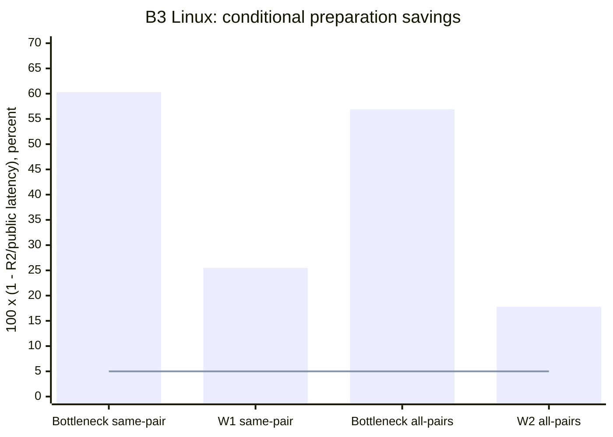
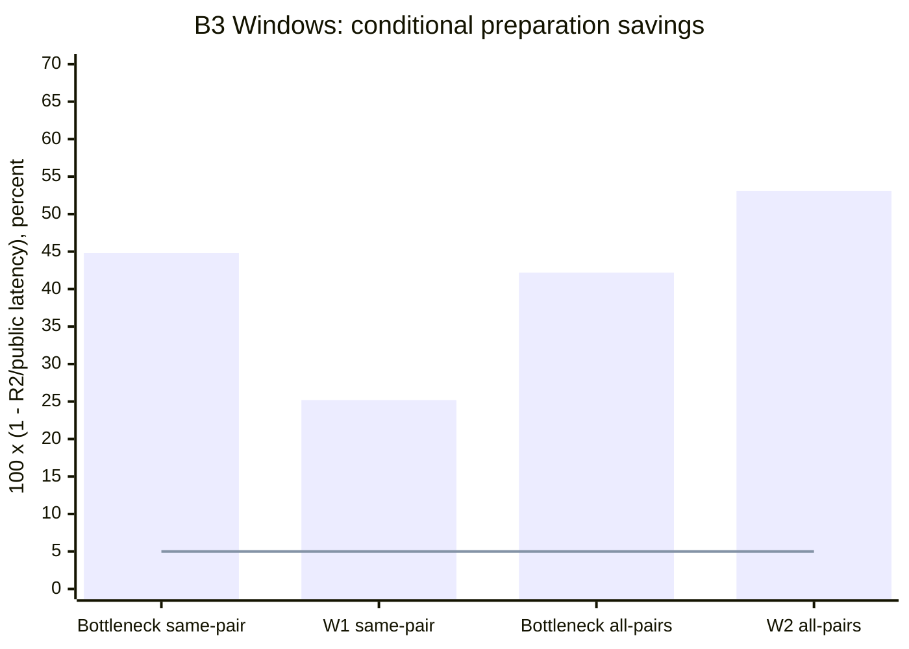

# Diagram-distance state lifetimes

[Benchmarks](../README.md) / [Reports](README.md)

## Question and conclusion

This comparative study answers [Issue #18](https://github.com/Aequiludium/cocycle-rs/issues/18):
which exact distance state should survive a pair, a batch, or repeated batches?
**Recommend a separate, scoped prepared-representation design investigation for
duplicate-heavy repeated comparisons. Do not promote the tested batch-local or
persistent scratch pool, retained-output variant, or a public Workspace/Batch API.**
Bottleneck has several early cross-platform preparation break-even points; W1
same-pair and W2 all-pairs also meet the preregistered early-reuse gate. Benefits
depend on the workload and metric. Small inputs, ordinary single-pair calls and
large uniform solve-heavy inputs do not justify a universal lifecycle abstraction.

All candidates are benchmark-only generated copies. Production Rust, solver
policies, public APIs, coverage, contexts and canonical diagram access remain
identical to [Phase-2 R0](phase2-baseline.md). This study measures candidate
behavior; it does not deliver a stable PreparedDiagram, change production routing,
or settle Issue #14's production disposition. Synthetic fixtures and an uncontrolled
WSL/Windows host limit application and hardware generalization.

## Measured revision and environment

| Item | Recorded value |
| --- | --- |
| Associated PR | None for this study; local branch `codex/phase2-resource-study` |
| Production kernel | `b2c3bd5eebf0c1193f30ea651012b8ae61b274c1`, immutable integrated R0 |
| Candidate generator and harness | `ec27c66b5db2a67d37c7a9ed5d1317051fa9cdc6`; all formal starts clean and non-exploratory |
| Identity | Both builds' 111 original-source hashes, generated files, worker/pool/generator and binary SHA-256 retained and checked; source/kernel snapshots archived |
| Protocol | `cocycle-distance-lifecycle-v1`; [frozen execution contract](https://github.com/Aequiludium/cocycle-rs/blob/ec27c66b5db2a67d37c7a9ed5d1317051fa9cdc6/benches/distances/README.md#persistent-lifecycle-study), separate from fresh-process `cocycle-distance-v1` |
| Execution date | 2026-10-01 UTC; individual starts and commands retained in manifests and samples |
| Machine | Intel Core Ultra 7 155H, 22 logical processors, same physical host; guest reports 11 cores/22 threads, host physical topology differs |
| Linux | Ubuntu 24.04 / WSL2, kernel 6.6.87.2, Python 3.12.3; rustc 1.91.0 `f8297e351` |
| Windows | Windows build 26100, MSVC; rustc 1.98.1 `48a229cea`, bundled Python 3.12 |
| Build | Release locked offline library; generated worker `rustc --edition=2024 -O --cfg cocycle_distance_bench`; full build commands retained |
| Affinity | Linux serial worker CPU 0; concurrent workers consecutive guest CPU IDs 0..N-1. Windows inherits host scheduling |
| Controls | Serial stages, no simultaneous compilation/tests/formal runs; Linux OMP/OpenBLAS/MKL threads 1 |
| Limits | Ready/operation observer timeouts 180 s, final exit 10 s; these are harness limits, not library resource budgets |
| Uncontrolled | Host background load, frequency, thermals, physical-core class, NUMA placement and WSL scheduling; no cross-machine absolute-time comparison |

## Workloads and comparison contract

Diagnostic decomposition covers nine families, sizes 8/32/128/512, tuning and
holdout seeds 20260922/20260923, and all three metrics. Performance discovery
covers N=32 uniform/duplicates; a source-audited adaptive survivor study covers
N=512 duplicates on Linux and Windows. Size controls include N=128 and selected
N=512 cases. Exact original f64 fixture bits, logical computed dimension 0,
multiplicity and operand orientation are preserved. Performance diagrams are
complete, finite and off-diagonal. Bottleneck uses L-infinity, W1 order 1 with
L-infinity, W2 order 2 with Euclidean norm and the final square root.

Six workloads are separate: single, same-pair, one-to-many, many-to-one,
repeated-batch and all-pairs. K scans 1,2,4,8,16,64,256,1024; single only uses 1.
Repeated batches have eight operations and distinct diagrams per batch.
All-pairs includes the complete directed matrix and self-pairs over
`max(2,ceil(sqrt(K)))` operands. Thus requested all-pairs K=1 executes **four**
comparisons over two operands, already with reuse; it is not single-shot evidence.
Every summary records actual operation and operand counts.

| Variant | State lifetime |
| --- | --- |
| public | Separately linked ordinary R0 logical public calls |
| R0 | Generated-copy ordinary calls, controlling generator/pool overhead |
| R1 | Prepared fixed reused operand |
| R2 | Prepared operands whose observed frequency exceeds one; pair-local solver state |
| R3 | R2 plus cleared capacity reuse within a batch |
| R4 | R2 plus cleared capacity reuse across batches |
| R5 | R4 plus retained batch output Vec |
| bounded | R4 with a 4096-byte cutoff **per scratch slot**, not a total quota |

Matching, dual variables, graphs, residual networks and heaps stay pair-local;
no cross-target semantic warm start is tested. Wasserstein caches diagram-local
points, then recomputes pair scale and normalization; non-unit scale can require
pair-local copies. Bottleneck caches diagonals, order, groups and geometry.

## Measurement and sampling

Inputs and diagrams are built before timing. Two initial operations warm generated
code, then candidate caches/capacities are dropped. The whole-sequence monotonic
timer includes frequency counting, preparation, per-operation semantic checks,
finite solve, output growth and scalar equivalence checks. Inner phase timers are
disabled for selection. Result/caches retained at the final observation are not
destroyed inside that interval. Separate detailed clocks overlap; do not sum them
or infer an exclusive allocation percentage from scratch-initialization time.

Each comparative cell retains one discarded fresh process and 12 measured
processes per variant, balanced by seeded cyclic position. Medians and min/max
retain every measured sample. The early prepared gate requires >=5% total savings
against **both** public and generated R0, >=10/12 paired-round wins, tuning and
holdout agreement, Linux/Windows replication and stable later scanned K. K* is the
first scanned K passing all later points; only joint K* <=64 admits early reuse.
Late passing points are retained but do not satisfy that gate. Workspace needs
>=5% incremental savings over R2; cross-batch also needs >=5% over R3, bounded
retention and acceptable concurrent throughput. There is no machine-timing test
assertion in production tests.

Complete controller records cover **1,543 cells, 92,604 measured processes and
9,301 discarded warmups**, including diagnostic phase cells, completed cells from
stopped controls and both clock-replay attempts. Separate scale controls add 48
measured/48 discarded processes; per-call tail diagnostics add 126/126. Counts do
not rank unfinished cells or treat diagnostic samples as comparative evidence.
All complete sample identities/counts and input hashes were audited.

Two uniform N512 size-control scans stopped under Issue #18's Phase-A cost gate:
W1/W2 point preparation was 5.8/7.3 us versus 175/187 ms total; Bottleneck
preparation 10.6 us and scratch initialization 1.9 us versus 65 ms. Their 14/96
and 3/8 completed cells, unfinished samples and stopped statuses are preserved.
These are negative cost findings, not silently missing cases.

The final clock audit found realtime discontinuities in single-worker metadata,
which do not affect Instant-based latency. A Linux two-worker tuning W2 round had
negative epoch spans; its entire cell is excluded from aggregate-throughput
ranking. An identical replay overlapped the file audit and remains an excluded
control. A subsequent isolated 12-round replay, with all epoch/monotonic spans
passing, supplies that cell below. Original attempts remain archived. No candidate
timing threshold triggered the replay. Issue #19 will use one parent monotonic
group clock to avoid this failure mode.

## Prepared amortization and workspace ablations

N512 duplicates R2 break-even points below include both splits. "none" means no
stable point in the scanned range, rather than a claim about infinite reuse.

| Metric | Pattern | Linux K* | Windows K* | Joint K* |
| --- | --- | --- | --- | --- |
| bottleneck | same_pair | 2 | 8 | 8 |
| bottleneck | one_to_many | 4 | 16 | 16 |
| bottleneck | many_to_one | 8 | 64 | 64 |
| bottleneck | repeated_batch | 8 | none | none |
| bottleneck | all_pairs | 1 | 1 | 1 |
| w1 | same_pair | 8 | 16 | 16 |
| w1 | one_to_many | 256 | 1024 | 1024 |
| w1 | many_to_one | none | 256 | none |
| w1 | repeated_batch | none | none | none |
| w1 | all_pairs | 256 | 64 | 256 |
| w2 | same_pair | 8 | 256 | 256 |
| w2 | one_to_many | 64 | 1024 | 1024 |
| w2 | many_to_one | 16 | none | none |
| w2 | repeated_batch | none | none | none |
| w2 | all_pairs | 8 | 16 | 16 |

The early cross-platform survivors are Bottleneck same-pair/one-to-many/
many-to-one/all-pairs, W1 same-pair, and W2 all-pairs. W1 all-pairs and W2
same-pair pass only at later joint K; repeated-batch preparation has no stable
joint point. The N32 matrix and every rejected variant remain in the full matrix.

The following **holdout K64** slice shows absolute amortized latency, its 12-sample
min/max and both controls. Time ratios below one are faster. It is descriptive:
a favorable median alone does not satisfy the paired-win/stable-K gate.

| OS | Split | Metric | Pattern | R2 us/op | R2 range | R2/public | R2/R0 | R3/R2 | R4/R3 |
| --- | --- | --- | --- | --- | --- | --- | --- | --- | --- |
| linux | holdout | bottleneck | same_pair | 6.746 | 6.204-7.871 | 0.397 | 0.388 | 0.964 | 1.045 |
| linux | holdout | w1 | same_pair | 13.510 | 12.675-15.741 | 0.745 | 0.697 | 1.139 | 0.983 |
| linux | holdout | w2 | same_pair | 12.835 | 12.418-14.881 | 0.700 | 0.696 | 1.169 | 0.983 |
| linux | holdout | bottleneck | all_pairs | 6.798 | 6.258-7.743 | 0.431 | 0.420 | 1.031 | 0.951 |
| linux | holdout | w1 | all_pairs | 16.994 | 14.566-25.039 | 0.823 | 0.791 | 1.110 | 0.982 |
| linux | holdout | w2 | all_pairs | 16.290 | 14.731-19.633 | 0.822 | 0.771 | 1.093 | 1.010 |
| windows | holdout | bottleneck | same_pair | 12.780 | 11.734-14.423 | 0.552 | 0.582 | 1.022 | 1.056 |
| windows | holdout | w1 | same_pair | 16.810 | 14.677-34.291 | 0.748 | 0.747 | 1.165 | 0.853 |
| windows | holdout | w2 | same_pair | 17.929 | 16.453-32.552 | 0.804 | 0.775 | 0.951 | 1.042 |
| windows | holdout | bottleneck | all_pairs | 11.537 | 10.244-21.745 | 0.578 | 0.602 | 1.018 | 0.962 |
| windows | holdout | w1 | all_pairs | 17.526 | 16.102-37.625 | 0.530 | 0.485 | 1.103 | 0.958 |
| windows | holdout | w2 | all_pairs | 16.149 | 14.931-32.811 | 0.469 | 0.554 | 1.102 | 1.009 |

For example, Linux duplicate Bottleneck preparation is visible in coordinate,
diagonal, ordering and grouping diagnostic scopes; W1/W2 collection is distinct
from pair normalization and finite solve. These diagnostic clocks explain a
candidate; they cannot establish its comparative speed. R3/R4 sometimes have
favorable individual medians, but the pool adds bookkeeping and reset costs,
especially for weighted matching. The joint incremental gate does not justify
promoting this capacity-only pool. This is a scoped no-go for the tested pool,
not proof that every possible internal scratch implementation must fail.

### Conditional prepared-reuse comparison

These are selected **N512 duplicates, holdout K64** whole-sequence R2/public
latency savings; all four metric/pattern combinations have early joint K* in
the full matrix. The 5% line visualizes only the savings part of the gate.
The full gate also requires generated-R0 savings, paired wins, both splits,
both platforms and stable later K. A favorable plotted slice alone is not an
adoption proof. Timers include preparation/bookkeeping but exclude final
retained-state destruction. Original medians and min/max remain in the table
above. Absolute Linux/Windows timings cannot be compared as a hardware ranking.





## High-water retention

Poison traces run three small pairs, one large pair, then eight small pairs.
The large Bottleneck control has 4096 points; W1/W2 use 1024. Each reference is
solved in a separate process before the measured worker, avoiding allocator
pre-poisoning. Observation IPC/RSS is outside per-call micro-clocks; trace cadence
differs from ordinary sequence timing. Below are holdout medians over 12 processes.

| OS | Metric | Variant | Before bytes | Huge bytes | Final bytes | Final RSS MiB | Post-small median us |
| --- | --- | --- | --- | --- | --- | --- | --- |
| linux | bottleneck | r2 | 0 | 0 | 0 | 3.60 | 72.740 |
| linux | bottleneck | r4 | 5632 | 599552 | 599552 | 4.07 | 78.249 |
| linux | bottleneck | bounded | 5632 | 9728 | 9728 | 3.60 | 73.788 |
| linux | w1 | r2 | 0 | 0 | 0 | 3.39 | 119.510 |
| linux | w1 | r4 | 1386 | 43050 | 43050 | 3.39 | 97.626 |
| linux | w1 | bounded | 1386 | 2050 | 3370 | 3.39 | 119.095 |
| linux | w2 | r2 | 0 | 0 | 0 | 3.39 | 258.366 |
| linux | w2 | r4 | 1386 | 43050 | 43050 | 3.39 | 185.661 |
| linux | w2 | bounded | 1386 | 2050 | 3370 | 3.31 | 225.080 |
| windows | bottleneck | r2 | 0 | 0 | 0 | 4.69 | 84.000 |
| windows | bottleneck | r4 | 5632 | 599552 | 599552 | 5.05 | 89.050 |
| windows | bottleneck | bounded | 5632 | 9728 | 9728 | 4.72 | 85.850 |
| windows | w1 | r2 | 0 | 0 | 0 | 5.08 | 113.350 |
| windows | w1 | r4 | 1386 | 43050 | 43050 | 5.14 | 120.850 |
| windows | w1 | bounded | 1386 | 2050 | 3370 | 5.16 | 115.600 |
| windows | w2 | r2 | 0 | 0 | 0 | 5.09 | 183.350 |
| windows | w2 | r4 | 1386 | 43050 | 43050 | 5.09 | 174.350 |
| windows | w2 | bounded | 1386 | 2050 | 3370 | 5.15 | 195.450 |

Bottleneck R4 retains 599,552 scratch bytes after the large call on both platforms;
the per-slot bound leaves 9,728 bytes. W1/W2 R4 retains 43,050 bytes. Dropping Vec
capacity does not imply matching RSS release: input storage, runtime and allocator
pages remain. Retained counters count Vec payload capacities, excluding allocator,
HashMap/header overhead and in-use temporaries. Prepared bytes and output bytes
are separate. Linux weighted post-small improvements do not consistently reproduce
on Windows and do not overturn the workspace decision.

## Selected concurrency validation

N512 duplicates, all-pairs K4096, public/R0/R2, both splits and three metrics use
1/2/4 independent worker processes and 12 measured groups. Two/four-worker
throughput uses the validated compute envelope, excluding observer IPC. RSS here
is endpoint RSS summed across workers, **not** cgroup aggregate or unique pages;
summed individual peaks are separately retained and are not simultaneous peaks.
No saturation knee or machine-capacity conclusion follows from three worker counts.
Holdout results follow; R2/public throughput greater than one is faster.

| OS | Workers | Split | Metric | Public ops/s | R2 ops/s | R2/public throughput | Public RSS MiB | R2 RSS MiB | R2 p95 mean us |
| --- | --- | --- | --- | --- | --- | --- | --- | --- | --- |
| linux | 1 | holdout | bottleneck | 54168 | 145000 | 2.677 | 4.54 | 5.92 | 8.031 |
| linux | 1 | holdout | w1 | 48988 | 64408 | 1.315 | 4.54 | 5.49 | 16.238 |
| linux | 1 | holdout | w2 | 51293 | 67947 | 1.325 | 4.54 | 5.57 | 19.953 |
| linux | 2 | holdout | bottleneck | 98683 | 267094 | 2.707 | 8.91 | 11.84 | 7.628 |
| linux | 2 | holdout | w1 | 90376 | 125909 | 1.393 | 9.08 | 11.00 | 16.469 |
| linux | 2 | holdout | w2 | 90189 | 119634 | 1.326 | 9.09 | 10.98 | 19.476 |
| linux | 4 | holdout | bottleneck | 150533 | 384904 | 2.557 | 17.57 | 23.67 | 13.091 |
| linux | 4 | holdout | w1 | 140720 | 182366 | 1.296 | 18.17 | 21.95 | 22.716 |
| linux | 4 | holdout | w2 | 137965 | 193603 | 1.403 | 18.17 | 21.96 | 22.415 |
| windows | 1 | holdout | bottleneck | 49484 | 88704 | 1.793 | 5.92 | 7.34 | 12.355 |
| windows | 1 | holdout | w1 | 43578 | 57436 | 1.318 | 6.17 | 7.11 | 18.582 |
| windows | 1 | holdout | w2 | 45267 | 60177 | 1.329 | 6.18 | 7.10 | 17.385 |
| windows | 2 | holdout | bottleneck | 72286 | 140611 | 1.945 | 11.84 | 14.68 | 14.801 |
| windows | 2 | holdout | w1 | 76690 | 102672 | 1.339 | 12.35 | 14.22 | 26.130 |
| windows | 2 | holdout | w2 | 82725 | 113787 | 1.375 | 12.32 | 14.18 | 19.482 |
| windows | 4 | holdout | bottleneck | 145493 | 273595 | 1.880 | 23.67 | 29.34 | 15.719 |
| windows | 4 | holdout | w1 | 126034 | 177872 | 1.411 | 24.70 | 28.32 | 23.592 |
| windows | 4 | holdout | w2 | 134955 | 188465 | 1.397 | 24.66 | 28.38 | 23.481 |

Prepared throughput gains survive these selected worker counts while endpoint
RSS rises. R2 prepared capacity for a 64-operand Bottleneck batch is 1,572,864
bytes; weighted point capacity is 1,048,576 bytes before per-worker multiplication.
Issue #19 must include this retained state and residence time in its memory model.
These data support the selected preparation direction, not a persistent scratch API.

The p95 column is nearest-rank p95 of **whole-loop mean per-operation latencies**
across measured worker children. Separate holdout K64 per-call diagnostics use
nearest-rank p95 over observed calls and include a different cadence; both original
warmup and measured groups are retained, never pooled with formal whole-loop runs.

## Correctness, verification and decision

Every operation agrees with ordinary R0 under the worker's fixed numerical
contract. Tiny smoke inputs additionally use the independent exact partial-
injection oracle. Worker selftests cover finite/essential/empty/multiplicity,
computed-empty versus uncomputed dimensions, incomplete coverage, incompatible
contexts, operand and metric alternation, and valid-failed-valid recovery for
invalid input, numerical, allocation and work-limit failures. A generated copy of
R0's deterministic cancellation hook tests cancellation after scratch allocation
and a successful retry for all three metrics on both platforms. Twelve separate
weighted scale controls include exponents -300/+300 and mixed scales.

Linux's 94 tool tests, source/docs/local collaboration checks and standalone
lifecycle formatting passed. Windows controller tests and worker selftests passed.
Production source/manifests are identical to R0, so the baseline's independent
Topp/GUDHI acceptance remains its evidence; no new external-oracle ranking or
hosted CI result is claimed for these local candidates. Final report/documentation
checks are recorded separately from measured harness identity.

Decision: investigate a separate immutable prepared representation with explicit
dimension/context/coverage ownership, starting from the surviving duplicate-heavy
workloads. Do not expose the tested scratch pool or output retention. Batch
ergonomics/scheduling would require their own evidence. The separate
[B5 / #31](https://github.com/Aequiludium/cocycle-rs/issues/31) now tracks this
scoped preparation question; it is not a public API adoption. The B1-B4 campaign
closes through its summary PR with no production adoption, including #19's
negative routing result. Preserve the original measured scope and gates.

## Evidence and reproduction

Evidence is local-only, without a public retention commitment. Root:
`target/benchmarks/commit-b2c3bd5eebf0/phase2-lifecycle/`. It retains preregistration,
adaptive gates, all successful/unfinished samples, clock validity decisions,
fixtures, generated/source/binary hashes, builds, full timing/gate/break-even
matrices, checks, scale/cancellation controls, tail diagnostics and PNG plots.
`analysis/report-tables.md` preserves both splits behind the selected tables.

Portable archive: `target/deliverables/phase2-lifecycle-b2c3bd5eebf0/phase2-lifecycle-evidence.zip`.
Size: **179,435,481 bytes**; **212,666 inventoried
members**, each length and SHA-256 verified after compression. Archive SHA-256:
`2e849df2d7f24bfd45242c5e1c898effa3bc153626f7079d8a6493081d357df7`. Kernel/harness Git snapshots, Windows generated sources,
original failed development attempts and orchestration/analysis code are included;
Cargo caches and plotting-library installations are excluded. The subsequent
report/CI commit is distinct from the measured harness commit.

From clean measured harness ec27c66 with the recorded platform/toolchain, use
fresh output directories; full commands are also archived:

```sh
python3 tools/profile_distance_lifecycle.py --families uniform duplicates --sizes 32 --samples 12 --cpu 0 --output target/lifecycle-replay/discovery
python3 tools/profile_distance_lifecycle.py --families duplicates --sizes 512 --variants public r0 r1 r2 r3 r4 --samples 12 --cpu 0 --output target/lifecycle-replay/survivors
python3 tools/profile_distance_lifecycle.py --worker-dir target/lifecycle-replay/survivors/build --families duplicates --sizes 512 --patterns all_pairs --ks 4096 --variants public r0 r2 --workers 4 --samples 12 --cpu 0 --output target/lifecycle-replay/concurrent4
```

Windows uses the same commands without `--cpu`. Run poison commands from the
execution contract separately. Adaptive cost stops and the clock replay are
explicit provenance, not changes to the original measurements. Another host may
produce different ratios; retain contrary results before extending the decision.
