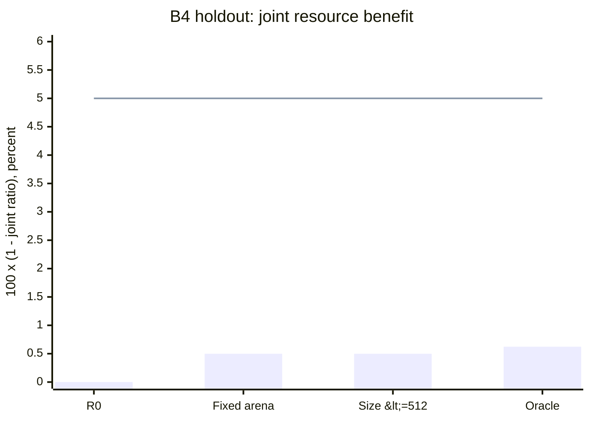
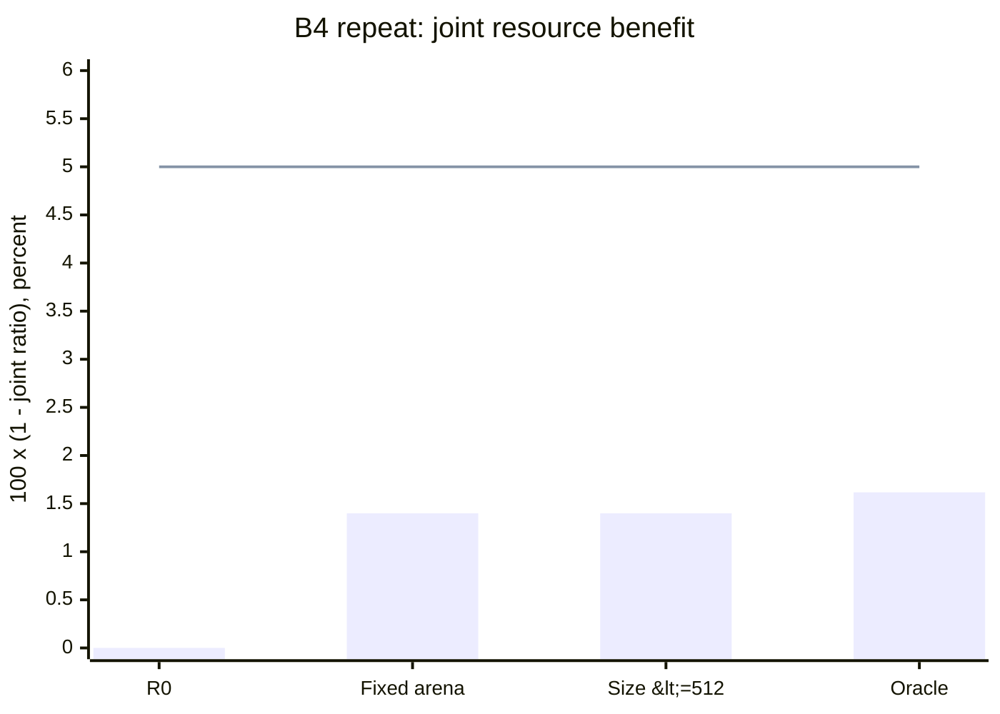
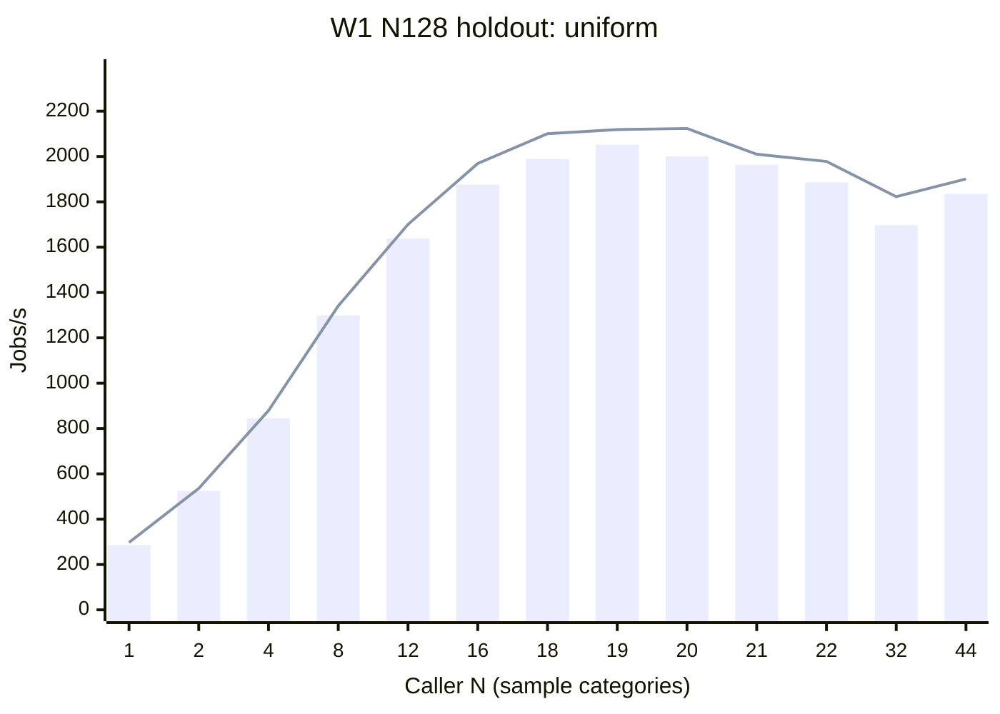
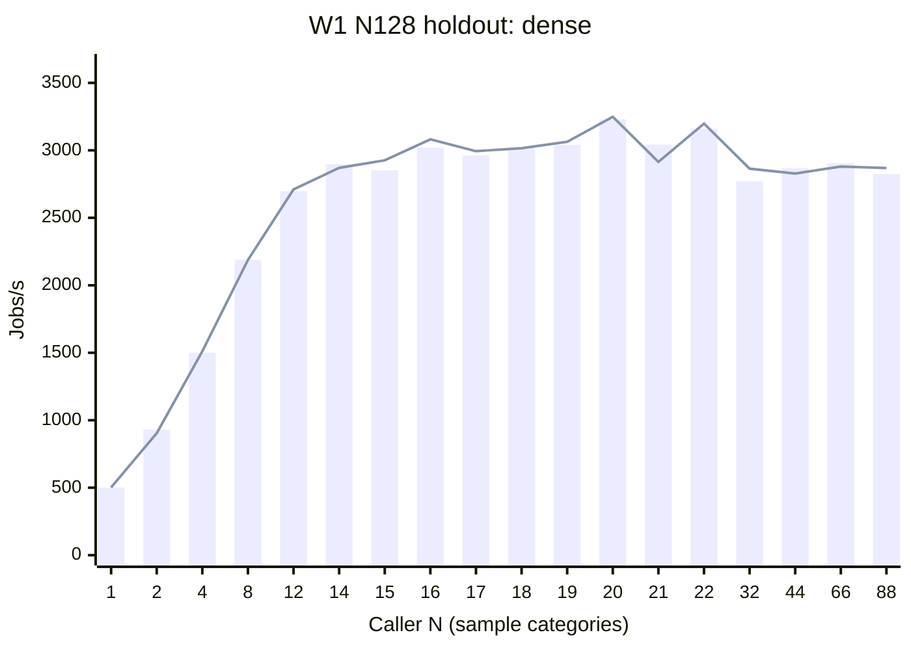
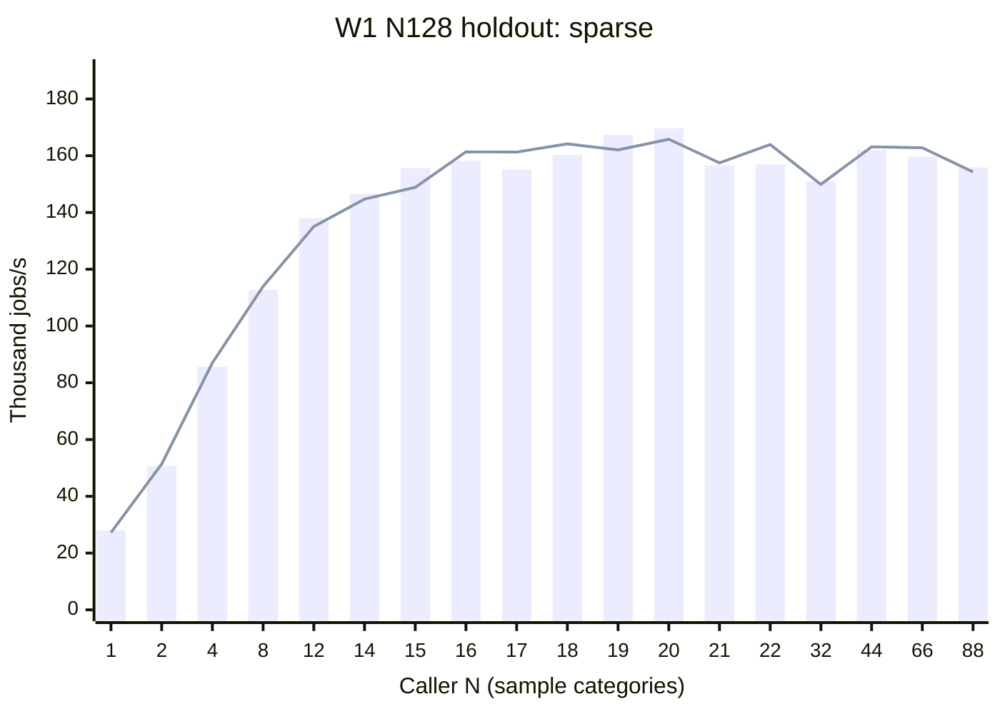
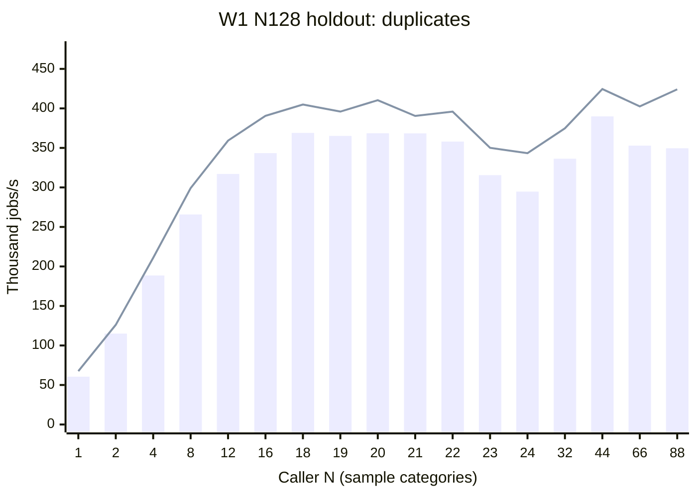

# Diagram-distance concurrent resources

[Reports](README.md) / [Frozen protocol](https://github.com/Aequiludium/cocycle-rs/blob/e1ceba853347f84d0f40396b09255939cedb9a40/benches/distances/README.md#concurrent-resource-study)

## Decision and scope

The available-host study for [Issue #19](https://github.com/Aequiludium/cocycle-rs/issues/19)
is complete: finite concurrency curves, independent repeats, heterogeneous pairs,
cold phase replay, CPU/PSS model contrasts and a deployable-policy decision have
been measured and audited. **Retain integrated R0. No tested deployable policy
passes the preregistered joint resource/performance gate on both holdout and the
independent repeat.** The private arena candidate remains research code; no
production router, public Prepared/Workspace/Batch API or host-load API is added.

This completes the feasible experiment and its negative adoption decision, not
the unavailable full CPU/RAM/DRAM model. DRAM traffic and LLC events remain
`null`; PSS is a sampled proportional-page proxy, not enforced cgroup RAM.
No physical bottleneck, RAM saturation or universal machine-capacity claim is
supported. The [Issue #18 lifecycle decision](distance-lifecycle.md) remains:
investigate scoped preparation for repeated comparisons in
[B5 / #31](https://github.com/Aequiludium/cocycle-rs/issues/31); reject the tested
scratch/output retention. Retaining measured code is the final optimization
disposition supported by this study.

## Immutable identities and execution

| Item | Recorded identity |
| --- | --- |
| Associated PR | [Direction B summary #32](https://github.com/Aequiludium/cocycle-rs/pull/32); report-only closeout, not a measured PR head |
| Production baseline/candidate source | `b2c3bd5eebf0c1193f30ea651012b8ae61b274c1`; all `src/` and Cargo files unchanged |
| V2 worker/controller/model | `e1ceba853347f84d0f40396b09255939cedb9a40` |
| V2 protocol | `cocycle-distance-resources-v2` |
| Source fingerprint SHA-256 | `a756098085007886c639f4ce6026d8b373d79a9207e44d5912ea695148a9b6d1` |
| Generated worker SHA-256 | `c9164e21c8d422d81c13b62ecb306ea7dcdfa81a60e717e9189e8b1d42d8b6d0` |
| Worker binary SHA-256 | `da75ee00a89e58406de5512e7e51ebcdbcd65e6cc2a8da111f755c212bb49337` |
| Build | Rust 1.91.0 `f8297e351`; locked offline release library; generated worker `rustc --edition=2024 -O --cfg cocycle_distance_bench` |
| Host | Intel Core Ultra 7 155H; Ubuntu 24.04/WSL2 Linux 6.6.87.2; 22 allowed logical CPU IDs |
| Placement | Processes pinned round-robin to IDs 0..21; threads share the selected CPU mask; N > 22 explicitly oversubscribes |
| Controls | Serial measurement stages; no overlapping builds/tests/compression/analysis; frequency and external host load uncontrolled |
| Limits | 120-second result wait; no resource-study address-space cap or writable cgroup |

The source fingerprint hashes canonical sorted JSON containing the build's
`originals` and `owners` maps. Original sources were checked against R0; all
instrumentation/model owners against the frozen harness; generated source and
binary against build metadata. The report revision is not a measured revision.
The 22 guest CPU IDs do not establish physical-core or cache isolation.

V2 began on 2026-10-01 UTC and resumed on 2026-10-02 UTC. The original execution
session stopped during W2 concurrency without a controller failure marker. Its
14 complete cells and incomplete fifteenth cell are preserved separately in
`interrupted-attempts/`; the entire unfinished stage was repeated with its frozen
command. Completed earlier stages were preserved. No selective favorable retry
or outlier removal was used. All resumed stages completed. Monotonic clocks own
timings; UTC metadata does not replace them.

The original V1 tranche remains separate: harness
`0156860b614fed9f13d60e254e53435858e97d3f`, 36 cells, 1,080 measured groups,
2,232 measured child processes and 2,223,360 calls. Its forced vector/arena
controls explain the large benefit of adaptive decomposition on sparse inputs,
but cannot select the V2 default. No V1 observations enter V2 fits or rankings.

## Workloads, coverage and timing

All nine maintained families are represented: uniform, clustered, near-diagonal,
duplicates, imbalanced, separated, threshold-shell, dense and sparse. Generator
seeds are 20260922 tuning and 20260923 holdout, with exact f64 endpoint binaries.
W1 uses L-infinity cost. W2 uses Euclidean squared cost and the final square root;
the earlier V1 report's statement that both use L-infinity was incorrect.
Bottleneck controls use the maintained finite-pair convention. There is one
fixture per family/size/split, so these are independent seeded fixtures, not a
population-distribution confidence claim.

| Stage | Scope |
| --- | --- |
| Primary process curves | Uniform/dense/sparse/duplicates, size 128, W1; N = 1/2/4/8/12/16/20/22/32/44 plus tuning-selected extensions and N95 neighborhoods on both splits |
| Threads | Primary W1, size 128, N = 1/8/22/44; separate shared-input process contract |
| Broad serial | Nine families, sizes 32/128/512, W1/W2, both splits, N1 |
| W2 parallel | Nine families, size 128, N8/22/44, both splits |
| Bottleneck control | Uniform/duplicates, size 128, N1/8/22/44, baseline only |
| Warm resources | Primary W1, size 128, N1/8/22/44, three measured groups per route |
| Cold singles | Uniform/dense size 512 and sparse/duplicates size 4096, W1/W2, jobs1, three measured groups |
| Heterogeneous pairs | Five actual strategy types; all 15 unordered pairs including diagonals, N8/22, both splits; separate N8 traces |
| Phase replay | Primary cold W1, N2/8; synchronous and half-single-call-duration staggered dispatch, both splits |
| Independent repeat | All broad serial cells and primary N1/coarse-extended tuning N95/maximum N; exact input/jobs, fresh order seed 20261005 |

The independent audit checked **788 complete cells, 12,522 measured groups, 149,520 measured child processes and 178,591,662 calls**. It also checked 1,162 discarded groups, 13,684 discarded-group children and 170 separate baseline calibration groups. Full per-stage counts are in `audit/audit.json`.

Comparative cells use 12 fresh measured groups per route plus one discarded group;
resource cells use three measured groups plus one discarded group. Four baseline
calls calibrate observation duration to 100 ms, clamped to 1..4096 jobs. Counts
stay fixed across route/concurrency; repeats copy them exactly. Equivalent
fixture/job blocks balance policy positions, with seeded shuffled block order.
All samples, unfavorable outcomes and interrupted records are retained.

Every numerical job is checked against separately linked public R0. Prior V2
tiny smokes additionally enumerate independent exact matchings, including cold,
warm, process/thread, mixed, staggered and oversubscribed cases. These validate
the instrumentation contract, not external performance rankings. Unchanged
kernel Topp/GUDHI evidence belongs to the [R0 report](phase2-baseline.md); no new
external comparison or hosted CI result is claimed here.

Parent throughput includes dispatch, scheduling and result transport after ready,
but excludes process creation, parsing and readiness warmup. Native per-job
latency includes validation/copying, preparation, solve and cleanup, excluding
result transport. Pair-local state is fresh; inputs, code and allocator can be
warm. Resource tracing changes observation overhead and never ranks routes.
Scheduled CPU includes stalls while scheduled and procfs tick quantization.
Endpoint PSS includes parser/runtime/allocator and result-serialization residence;
it is not peak RSS or live solver memory. Trace integrals use their actual final
observation window, which can outlast the throughput envelope. Cold jobs1
measurements validate traces and are excluded from route selection.

Actual measured trace intervals: minimum 0.236 ms, median 1.044 ms, p95 7.637 ms, maximum 234.812 ms. Sequential procfs reads and observer scheduling limit resolution.

Using the same observed window, sampled peak times window overestimates the integrated PSS demand by a median factor of 1.056 for warm groups and 1.248 for cold singles. Every ratio is retained in `final-analysis/peak-vs-integral.json`; neither window is silently replaced by native time.

## Finite concurrency curves

N95 is the earliest measured caller count attaining 95% of the maximum on that
finite grid. Tuning alone selected extensions and the union of both routes'
N95 +/- 2 neighborhoods. Holdout never selected a grid point. Dense, sparse and
duplicates were extended to N88; uniform ended at N44. These are closed finite
groups, not open-loop server-arrival or sustained queue experiments.

| Family | Route | Tuning N95 | Holdout N95 | Holdout peak N | Peak jobs/s | Last/peak | Peak/N1 |
| --- | --- | ---: | ---: | ---: | ---: | ---: | ---: |
| dense | adaptive_arena | 16 | 20 | 20 | 3248.6 | 0.883 | 6.470 |
| dense | baseline | 18 | 20 | 20 | 3229.2 | 0.875 | 6.447 |
| duplicates | adaptive_arena | 18 | 18 | 44 | 424475.6 | 0.999 | 6.282 |
| duplicates | baseline | 18 | 44 | 44 | 389908.6 | 0.897 | 6.442 |
| sparse | adaptive_arena | 18 | 16 | 20 | 165800.6 | 0.931 | 6.092 |
| sparse | baseline | 19 | 19 | 20 | 169641.2 | 0.919 | 6.056 |
| uniform | adaptive_arena | 18 | 18 | 20 | 2123.8 | 0.895 | 7.148 |
| uniform | baseline | 18 | 18 | 19 | 2052.3 | 0.894 | 7.193 |

At the held-out independent-repeat points, repeated/original throughput spans 0.619..1.002, with median 0.880. Repeat N95 points were frozen from the coarse/extended tuning grid before neighborhood densification; they are not relabeled as newly selected final knees. The complete contrasts are in `final-analysis/repeat-knee-comparison.json`.

Plateaus/regressions and knee differences are observable on these grids; their
physical cause is not identified. Per-group ranges, thread contrasts, W2 and
Bottleneck controls and the exact independent repeat are retained in
`audit/matrix.json`; caller counts are not transferable hardware constants.
The independent repeat shows substantial run-to-run throughput shifts. Stages
occurred at different serial times across two days, so fitted load and pair
coefficients can also absorb temporal host/frequency effects. Within-stage
balanced comparisons help, but do not identify allocator/cache/DRAM causes.

## Tuning-only CPU/PSS models

M0 uses serial wall service as a CPU proxy and time times sampled peak as memory
demand. M1 substitutes scheduled CPU/job and PSS integral/job. M2 fits separate
linear load inflations, with the preregistered positive-demand floor. M3 adds
directed pair coefficients from tuning mixed groups; it leaves homogeneous M2
unchanged. Each model uses finite N/service and empirical CPU/PSS fluid caps.
Only primary size-128 W1 is fitted. Cold sizes and V1 never enter these fits.
Fitting rejects holdout. The 128-MiB proxy budget is a model contrast, not an OS
limit; separate sampled-peak feasibility contrasts use 2/4/8/16/32/128 MiB.

| Model | Homogeneous median / p95 error | Mixed median / p95 error | Overall max error | N95 median / max error | Crossover disagreement |
| --- | --- | --- | ---: | --- | ---: |
| M0 | 182.1% / 247.2% | 257.9% / 439.5% | 451.2% | 1.5 / 26 callers | 45.5% |
| M1 | 184.1% / 283.1% | 267.7% / 507.1% | 525.9% | 0.5 / 24 callers | 57.6% |
| M2 | 10.3% / 18.5% | 46.7% / 63.1% | 65.9% | 12.0 / 16 callers | 27.3% |
| M3 | 10.3% / 18.5% | 28.3% / 61.8% | 62.9% | 12.0 / 16 callers | 27.3% |

The fitted CPU proxy capacity is 18.009 scheduled cores. The retained complexity is **M3**, under the requirement that an upgrade improves median error by at least 10% on applicable subsets and worsens their p95 by at most 10%. M1/M2 compare both homogeneous and mixed subsets; M3 adds only mixed corrections and must improve mixed prediction while its homogeneous control stays exactly M2. This is a relative complexity decision, not certification that the retained model predicts well.

Improved throughput error does not imply improved knee or resource predictions: M2/M3 have 12-caller median N95 error versus 1.5 for M0, and 27.3% crossover disagreement. M2/M3 peak proxy median error is 67.1%. These contradictions prevent using the models as a production capacity or memory-admission rule.

| Model | CPU median / p95 error | PSS demand median / p95 error | Peak proxy median / p95 error | Budget-label disagreement |
| --- | --- | --- | --- | ---: |
| M0 | 65.7% / 81.0% | 48.7% / 79.6% | 109.7% / 239.7% | 18.8% |
| M1 | 68.4% / 82.5% | 24.0% / 64.2% | 230.3% / 500.3% | 27.1% |
| M2 | 42.7% / 66.1% | 15.3% / 33.0% | 67.1% / 136.2% | 16.7% |
| M3 | 42.7% / 66.1% | 15.3% / 33.0% | 67.1% / 136.2% | 16.7% |

All coefficients, predictions, residuals, N95 errors and sampled budget labels are
archived. Linear demand, pairwise corrections, finite grids, one fixture per
split and PSS sharing limit extrapolation. No third-order interaction study or
production resource-admission guarantee is inferred.

## Interference, phase replay and lifetime

Five actual strategy types are dense-baseline, uniform-baseline,
uniform-adaptive_arena, sparse-baseline and duplicates-baseline. They preserve
the existing adaptive decomposition and solver dispatch; no fictitious
dense/on-demand production option is introduced. Directed inflation compares
each type's native latency and scheduled CPU/job with its own homogeneous
diagonal at the same N/split. Traced N8 groups separately compare per-node PSS.
Different families can use different calibrated jobs; total mixed throughput
therefore does not equal either type's individual latency.
Per-node PSS integrals include waiting until the group's final ack; a larger
integral does not by itself show a larger live solver footprint.

Held-out mixed-performance, N22: directed native-latency ratios span 0.890..1.167; scheduled-CPU ratios span 0.909..1.143. Full directions and diagonal demands remain in `final-analysis/interference.json`.
Held-out mixed-resource, N8: directed native-latency ratios span 0.827..1.274; scheduled-CPU ratios span 0.818..1.333. Full directions and diagonal demands remain in `final-analysis/interference.json`.

Replay uses actual dispatch offsets, each observed single-call trace and its
initial PSS, then adds incremental demands above measured group-ready PSS.
Completed children remain resident until ack; replay keeps endpoint residence.
Three source traces are retained rather than selecting a favorable one. A naive
sum of individual peaks and a residence-adjusted peak rectangle are separate
comparators. Replay is evaluated on both splits, with an additional tuning-source
to holdout contrast; no source is time-stretched to fit the measured group.

| Validation | Incremental replay peak median / p95 error | Integral median / p95 error | Naive peak median error | Adjusted rectangle integral median error |
| --- | --- | --- | ---: | ---: |
| tuning | 10.2% / 64.0% | 8.2% / 28.0% | 57.0% | 77.6% |
| holdout | 9.2% / 107.5% | 8.8% / 29.2% | 51.0% | 72.8% |

3/96 cold single-call children have fewer than two interior samples, so their phase shape is unresolved. Tuning-source to holdout replay has 8.3% median peak error and 7.7% median integral error. Sampled peaks can miss transient demand; allocator, sharing and scheduling changes prevent treating either replay or peak sums as a hard budget certificate.

Issue #18 measured retained preparation capacity for 64 operands: 1 MiB for
weighted points and 1.5 MiB for Bottleneck, before per-worker multiplication.
The sensitivity is `M_R * H / K` MiB-seconds/job for residence H =
0.01/0.1/1/10/100 seconds and reuse K = 1/8/16/64/256/1024. For weighted points
it spans 0.000009765625..100; Bottleneck scales each by 1.5. At H1/K64 it is
0.015625 and 0.0234375 respectively. These are hypothetical residence/reuse
contrasts using measured capacity, not newly measured prepared-route timings.
They preserve #18's early-reuse survivors and scratch/output no-go.

## Deployable policy and independent repeat

The tuning search considers size thresholds 32/128/512/infinity in both
orientations, preserving baseline on ties. Family labels and diagnostic counters
are prohibited router inputs. The empirical oracle is the faster measured route
per cell, a hindsight lower bound rather than deployable code. Regret follows the
Issue definition `1 - throughput_policy / throughput_oracle`; family regret is
the arithmetic mean over its equally weighted size/metric cells. Tuning minimizes
the preregistered geometric multiplicative time regret, also retained in artifacts.
Observations weight each family/size/metric equally. Endpoint PSS is specifically
a proxy, not peak RSS. The oracle does not prove hard-budget feasibility.

Tuning selected **arena on low side of size threshold 512**. Adoption requires geometric joint `sqrt(timeRatio * endpointPSSratio) <= 0.95`, each applicable family time/PSS ratio <= 1.10, and the same result in the independent repeat. Neither observed winners nor holdout retune the rule.

| Policy / evaluation | Time ratio | PSS ratio | Joint ratio | Regret median / p95 | Worst-family regret | Gate |
| --- | ---: | ---: | ---: | --- | ---: | --- |
| baseline / holdout | 1.000 | 1.000 | 1.000 | 1.0% / 15.1% | 10.6% | reference |
| baseline / repeat | 1.000 | 1.000 | 1.000 | 2.6% / 17.3% | 10.1% | reference |
| fixed arena / holdout | 0.982 | 1.009 | 0.995 | 0.0% / 3.3% | 1.5% | fail |
| fixed arena / repeat | 0.964 | 1.008 | 0.986 | 0.0% / 5.8% | 2.1% | fail |
| tuning size rule / holdout | 0.982 | 1.009 | 0.995 | 0.0% / 3.3% | 1.5% | fail |
| tuning size rule / repeat | 0.964 | 1.008 | 0.986 | 0.0% / 5.8% | 2.1% | fail |
| empirical oracle / holdout | 0.976 | 1.012 | 0.994 | 0.0% / 0.0% | 0.0% | not deployable |
| empirical oracle / repeat | 0.956 | 1.013 | 0.984 | 0.0% / 0.0% | 0.0% | not deployable |

The raw policy matrix retains worst-cell time/PSS ratios, every family aggregate,
crossover disagreements and tuning candidate objectives. An ordinary production
API optimization was not adopted because no deployable candidate passed the
gate. The instrumented private worker cannot establish ordinary-API speedups.
Production tests/rustdoc/examples/changelog require no semantic update: R0 is
unchanged. Future public lifecycle or routing work requires separate supporting
evidence rather than relaxing this experiment's thresholds after seeing results.

## Final performance figures

Bars show `100 * (1 - sqrt(timeRatio * endpointPSSratio))`; higher is
better. The horizontal line is the preregistered **5% joint benefit** requirement
(ratio <=0.95), needed on both evaluations with per-family guards. Equal
family/size/metric weights; endpoint PSS is a proxy. The size rule was selected
on tuning only. It selects arena for every evaluated size (32/128/512), so its
aggregate equals fixed arena here. Oracle means hindsight per-cell selection,
not a deployable policy. These are a presentation of frozen results, not a new
measurement or a population confidence interval.

Bars = R0 baseline; line = private adaptive arena. Each point is a
holdout median; all completed primary/extension/densification caller points are
shown. Caller values are **equally spaced sample categories**, not a continuous
linear N axis. The frozen PNG/SVG figures in the local evidence also show full
group min/max and independent-repeat markers; those raw figures are not Git
artifacts. Independent repeats are reported in the policy table and original
report: repeat/original throughput spans 0.619..1.002, median 0.880. These curves
do not identify a physical bottleneck or select a production admission limit.

## Evidence, validation and reproduction

All evidence is local-only and excluded from Git: V1/V2 raw samples and fixtures,
interrupted attempt, smokes/pilot, generated sources/binaries, build metadata,
preregistration, original/resume orchestration, audit, model predictions, policy
matrix, interference, replay and lifetime sensitivity. R0, V1 and V2 frozen Git
snapshots are included; Cargo caches are excluded. Fixture hashes and exact stage
commands are in manifests and `audit/audit.json`.

Archive: `target/deliverables/phase2-resources-complete-b2c3bd5eebf0/phase2-resources-complete-evidence.zip`; SHA-256 **`8cf98365415ed3f3b2932a9c00d308dd4a2d0c74a23fb0195ccca3e25ae508bc`**. All 195,944 inventoried members were read back and hash-verified. The external member inventory and `SHA256SUMS.txt` accompany it. The final maintained report carries the archive checksum; the frozen Git snapshots inside the archive carry measured code.

Before freezing V2, 98 Linux tool tests and four focused Windows tests passed;
warm/cold process/thread and mixed/staggered/oversubscribed tiny-oracle smokes
passed. Standalone formatting, source, documentation, local collaboration and
staged-artifact checks passed. After analysis, the independent complete-sample
audit and final source/documentation/collaboration/staged-artifact checks passed.
The 98 Linux tool tests were rerun after measurement and also passed.
No hosted CI, new Topp/GUDHI suite or physical counter validation is represented
as newly run. All ordinary numerical code remains exactly at R0.

To reproduce, restore the frozen V2 snapshot alongside unchanged R0 and use the
archived preregistration and serial orchestration with fresh output paths. V2
uses Linux procfs/taskset. The model command takes only process tuning/extension/
densification directories as `--train`, warm resources as `--resource`, mixed
performance as `--mixed`, and corresponding held-out process directories as
`--holdout`, with a fresh `--output`. Archived postprocessing scripts reproduce
the audit, policy and replay. The maintained report tables use those JSON outputs;
the final report and its generator are also supplied beside the evidence archive.
Do not pool V1, retune from holdout, rank
trace snapshots, or relabel this report revision as the measured harness.
